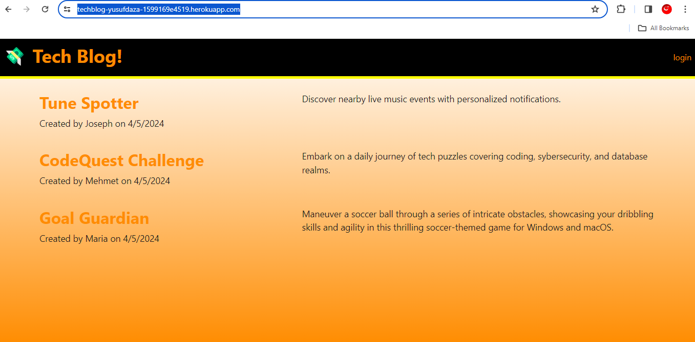

# Techblog! Model View Controller(MVC)

## Description

### What was your motivation?
- My motivation was to create a platform for developers to share their insights, experiences, and technical knowledge in a structured and interactive way. I aimed to provide a space where developers can engage with each other through blog posts and comments, fostering a community of learning and collaboration.

### Why did you build this project? 
- I built this project because I believe that writing about technology is as crucial as building it. By creating a CMS-style blog site specifically tailored for developers, I wanted to empower them to share their expertise, discuss recent advancements, and contribute to the tech community's collective knowledge.

### What problem does it solve?
- This project solves the problem of fragmented technical content by providing a centralized platform for developers to publish and access high-quality, curated blog posts. It also facilitates discussions and knowledge sharing through comments, enhancing collaboration and learning within the developer community.

### What did you learn?
- Through building this project, I learned how to architect a web application following the MVC paradigm, integrate authentication using express-session, work with Sequelize as an ORM for database management, and use Handlebars.js for templating.

## Installation

1. Navigate through your command terminal to your project directory.
2. Install dependencies using NPM(Node Package Manager) `npm install`.
3. Set up enviroment variables. Create a `.env` file in the root directory of the project and configurate the following environment variables: `DB_NAME=your_database_name`, `DB_USER=your_database_user`, `DB_PASSWORD=your_database_password`, `SESSION_SECRET=your_session_secret`.
4. Set up your MYSQL database according to the configurations specified in your `.env` file.
5. Start server. Launch the Node.js server to run the CMS-style blog site `npm start`.
6. Access the application. Open your web browser and navigate to `http://localhost:3001`.

## Usage

1. If you're a new user, click on the "Sign Up" link on the homepage and create a username and password. If you're an existing user, click on the "Sign In" link and enter your username and password.
2. Homepage; Upon signing in, you'll be redirected to the homepage where you can view existing blog posts and navigate to the dashboard or log out.
3. Dashboard; In the dashboard, you can manage your blog posts, including creating new posts, updating existing posts, or deleting posts.
4. Click on a blog post title to view its contents, creator's username, and comments. You can leave comments on posts by entering your comment text and clicking the submit button.
5. To log out of the application, click on the "Log Out" link in the navigation bar.

## Screenshots

## Features

[Heroku](https://www.heroku.com/home)

## License

MIT License

Copyright (c) 2024 Joseph Daza

Permission is hereby granted, free of charge, to any person obtaining a copy
of this software and associated documentation files (the "Software"), to deal
in the Software without restriction, including without limitation the rights
to use, copy, modify, merge, publish, distribute, sublicense, and/or sell
copies of the Software, and to permit persons to whom the Software is
furnished to do so, subject to the following conditions:

The above copyright notice and this permission notice shall be included in all
copies or substantial portions of the Software.

THE SOFTWARE IS PROVIDED "AS IS", WITHOUT WARRANTY OF ANY KIND, EXPRESS OR
IMPLIED, INCLUDING BUT NOT LIMITED TO THE WARRANTIES OF MERCHANTABILITY,
FITNESS FOR A PARTICULAR PURPOSE AND NONINFRINGEMENT. IN NO EVENT SHALL THE
AUTHORS OR COPYRIGHT HOLDERS BE LIABLE FOR ANY CLAIM, DAMAGES OR OTHER
LIABILITY, WHETHER IN AN ACTION OF CONTRACT, TORT OR OTHERWISE, ARISING FROM,
OUT OF OR IN CONNECTION WITH THE SOFTWARE OR THE USE OR OTHER DEALINGS IN THE
SOFTWARE.

